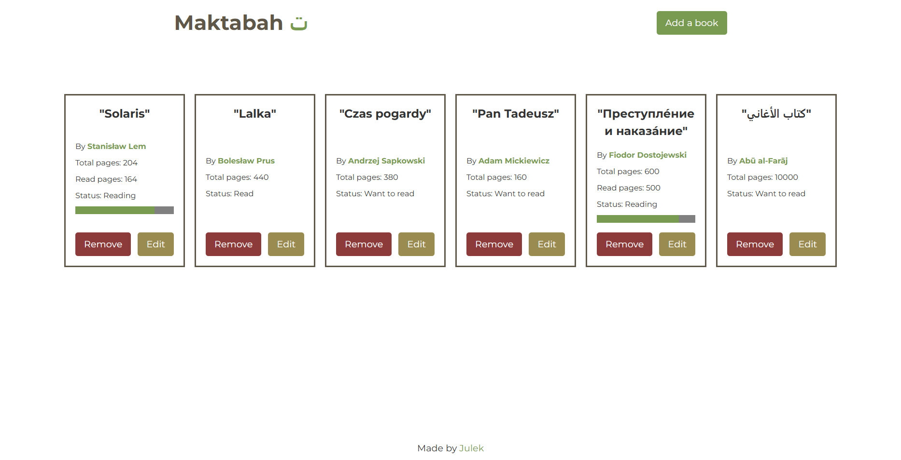

# Book Library

Welcome to **Maktabah** (مكتبة), a simple and elegant book library web application. This project allows users to manage their personal book collection by adding, editing, and removing books, as well as tracking their reading progress.

## Features

- Add new books with details like title, author, total pages, and reading status.
- Edit book details, including reading progress and status.
- Remove books from the library.
- Responsive and user-friendly design.
- Progress tracking for books marked as "Reading."

## Technologies Used

- **HTML5** for structure.
- **CSS3** for styling, including custom fonts and variables.
- **JavaScript** for interactivity and dynamic content updates.

## Screenshot



## How to Use

1. Clone the repository:
   ```bash
   git clone git@github.com:Jobrzut/Maktabah.git
   ```
2. Navigate to the project directory:
   ```bash
   cd BookLibrary
   ```
3. Open `index.html` in your browser to view the application.

## Future Improvements

- Add persistent storage using local storage or a database.
- Implement user authentication for personalized libraries.
- Enhance accessibility features.

## Credits

- Created by [Julek](https://github.com/Jobrzut).
- Inspired by the love for books and reading.

## License

This project is licensed under the MIT License. Feel free to use and modify it as needed.